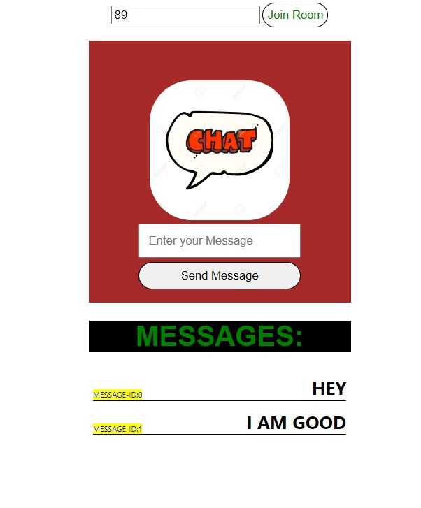

# Simple React Chat App Using Socket io

## Usage 

- Requires a common room Id for both users to chat and be on the Same Network

## Tools Used

- React

- Express

- Socket.io

- Cors

- Nodemon

- React Socket.io

## UI

## Author

- Eyoel Tekle
